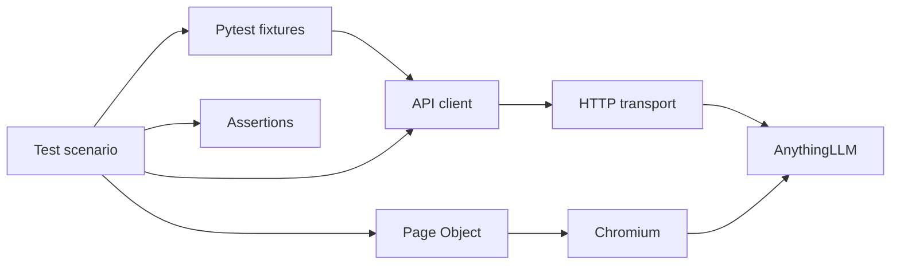

# Framework onboarding: understand the project in one hour

[Russian version](framework-onboarding.ru.md)

This guide is for an engineer joining the project who knows basic Python but has
not worked with this framework. After reading it and following the code, you
should be able to select a test layer, explain what a passing result means,
locate setup and cleanup, investigate a failure and add a small scenario.

The framework tests a local AnythingLLM application connected to Ollama. It also
tests its own transport, fixtures, reporting and browser abstractions. This is a
small, deliberately layered framework: each layer has a specific responsibility,
and expensive model calls are kept separate from fast framework checks.

## Your first hour

The timetable assumes Python and the relevant dependencies are already installed.
Downloading packages, browser binaries or models is additional setup time. You
can understand the framework without starting the application or a model.

| Minutes | Activity | What you should understand |
| --- | --- | --- |
| 0–10 | Read the glossary and test-layer table below. | What the application does and which checks answer which questions. |
| 10–20 | Read the architecture section and follow its file links. | Where requests, UI actions, setup and checks belong. |
| 20–35 | Follow the paid-leave walkthrough with the linked code open. | How pytest resolves fixtures and how one scenario reaches the application. |
| 35–45 | Run the offline unit suite and read the reporting/failure sections. | How to obtain a useful result without model generation. |
| 45–55 | Read the RAG strategy and extension guide. | Why wording, citations, captured context and judge scores are different signals. |
| 55–60 | Answer the self-check questions at the end. | Whether you can navigate and extend the project independently. |

Start with this guide, then use [automation/README.md](../automation/README.md)
as the command reference. Numbered `step-*.md` files record individual stages;
they are useful for deeper investigation, but reading them all is not required.

## 1. Understand the application before the tests

A user uploads a policy document, asks a question and receives an answer with
supporting sources. The test document describes fictional company rules, such as
23 working days of annual leave and a request deadline of 12 calendar days before
leave starts. It also explicitly excludes gym reimbursement information.

| Term | Meaning here |
| --- | --- |
| LLM | The language model that generates an answer. |
| Ollama | The local service serving generation and embedding models. The test code sends requests to it; the model does not run inside pytest. |
| AnythingLLM | The application handling documents, retrieval, workspaces and chat. |
| Workspace | An isolated application area with its own settings, indexed documents and conversations. It is unrelated to an IDE project directory. |
| Slug | The workspace identifier used in URLs, for example `automation-<unique-id>`. |
| Embedding | A numerical representation of document/query meaning used for similarity search. The embedding model retrieves relevant material; it does not write the final answer. |
| Indexing | Preparing uploaded document chunks and their embeddings for retrieval. Uploading alone does not prove that the workspace can retrieve them. |
| RAG | Retrieval-augmented generation: the application retrieves relevant document context and includes it in the model request. |
| Citation/source | A document reference shown with an answer. Useful evidence, but not necessarily the entire context sent to the model. |
| Fixture | A pytest-managed dependency that prepares data/resources and can register cleanup. Tests request fixtures by parameter name. |
| Assertion | A condition that must hold for a check to pass. |
| Judge | A model asked to assess an answer. It can make mistakes and must itself be checked. |

The default generation model is `qwen3.5:4b`; ordinary RAG tests also use
`qwen2.5:7b` when no model flag is supplied. The second model provides a comparison
case, not a claim that either model is universally better. The application setup
uses BGE-M3 for embeddings. Read the [workspace template](../config/workspace.json)
and [root setup guide](../README.md#components) for the configured environment.

## 2. Choose the smallest layer that can answer your question

A successful HTTP response, a visible chat bubble and a grounded answer are
three different observations. We therefore separate checks instead of treating
one end-to-end result as proof of everything.

| Layer | Question it answers | External dependencies | Main location |
| --- | --- | --- | --- |
| Unit | Does our framework handle valid, invalid and failure cases correctly? | HTTP is mocked; the capture-hook check needs Node.js. Some judge-adapter checks need evaluation libraries. | `tests/unit/` |
| Offline browser | Do our Page Object and waiting rules behave correctly in a real browser? | Chromium and deterministic local HTML; no app or model. | `tests/browser/` |
| Smoke/API | Is the app reachable, is authentication correct, and can documents/workspaces be managed and searched? | AnythingLLM, developer API key where needed; indexing needs the embedding provider. | `tests/test_health.py`, `test_authentication.py`, `test_workspace.py`, `test_documents.py` |
| RAG integration | Does a real generated answer contain required policy facts and supporting sources, or acknowledge missing information? | Application, API key, embeddings and a generation model. | `tests/test_rag.py` |
| Application UI | Can the user send a question, view an answer/source and reload its history? | The RAG environment plus Chromium. | `tests/ui/` |
| Saved quality | Do deterministic checks and existing judge evidence describe the same captured answer? | Saved files and reporting dependencies; no new model calls. | `tests/test_quality.py` |
| Live quality | Can we generate, capture, judge and report one answer with verified cleanup? | Capture overlay, app/models, evaluation and reporting dependencies. | `tests/test_live_quality.py` |

This separation helps locate failures and controls runtime. A URL-encoding bug
should be reproduced with a mocked HTTP session. A stale-answer locator should
be reproduced with local HTML. Neither investigation needs a generated answer.
A browser test is appropriate when the behavior depends on rendering or user
interaction; an API test is simpler when only application state matters.

Fast checks run in GitHub Actions: Ruff lint/format checks and offline unit tests
in one job, and offline Chromium Page Object checks in another. Live API, RAG and
application UI scenarios remain local. CI does not start AnythingLLM or download
language models. See [the workflow](../.github/workflows/framework-checks.yml).

## 3. Know where each responsibility belongs

The package lives under `automation/src/llm_testkit`. The tests consume the
package; they do not implement transport or resource ownership themselves.



The diagram shows the main responsibilities, not every function call. Reporting
records selected operations across these layers; it does not decide whether an
answer is correct.

| File/module | Responsibility | Why this boundary exists |
| --- | --- | --- |
| [config.py](../automation/src/llm_testkit/config.py) | Immutable settings, environment variables and URL/timeout validation. | A configuration error should be identified before it becomes a confusing network failure. |
| [core/http_client.py](../automation/src/llm_testkit/core/http_client.py) | Requests session, base URL, timeout, response and session closure. | Clients share one transport policy. There are no implicit retries; redirects are disabled by default so a redirect remains observable. |
| [clients/anythingllm_client.py](../automation/src/llm_testkit/clients/anythingllm_client.py) | Endpoint paths, URL encoding, payloads and file uploads. | Tests speak in operations such as `create_workspace`, not repeated request construction. Clients return raw responses and do not impose test acceptance criteria. |
| [pages/workspace_page.py](../automation/src/llm_testkit/pages/workspace_page.py) | UI locators, navigation, sending and source-opening actions. | An upstream label or DOM change can be fixed in one place without rewriting scenarios. |
| [assertions.py](../automation/src/llm_testkit/assertions.py) | Reusable application, answer, source and UI acceptance checks. | API and UI scenarios reuse the same policy rules and diagnostic messages. |
| [pytest_support/environment.py](../automation/src/llm_testkit/pytest_support/environment.py) | Paths, settings, API clients and shared scenario profiles. | Tests do not need to find local credentials or duplicate file-loading logic. |
| [pytest_support/resources.py](../automation/src/llm_testkit/pytest_support/resources.py) | Workspace/folder creation, upload, indexing and cleanup. | Resource ownership must remain reliable when a scenario or setup check fails. |
| [pytest_support/rag.py](../automation/src/llm_testkit/pytest_support/rag.py) | Model selection, metadata, generation and optional capture. | Comparisons need a record of the model/configuration that produced each answer. |
| [pytest_support/options.py](../automation/src/llm_testkit/pytest_support/options.py) | CLI flags, model/repetition matrix and opt-in validation. | Selection rules belong in one place and apply after `-k`/`-m` filtering. |
| `evaluation/` | RAGAS adapter, faithful-claim measurement and judge controls. | Evaluation mechanics can be investigated separately from app scenarios. |
| `reporting/` | Allure integration, combined quality evidence and stability summaries. | A reporter presents evidence; it must not silently retry or relax checks. |
| [tests/conftest.py](../automation/tests/conftest.py) | Plugin registration and assertion rewriting. | This entry point stays small rather than accumulating all setup logic. |

Integration tests use `Assertions` for application acceptance checks. Unit tests
use ordinary pytest `assert` to test the framework independently: a broken
framework assertion should not also be the tool used to verify its own output.
Unit tests block accidental Requests calls. They use mocked responses, scoped
patches and, for lifecycle/collection behavior, real child pytest runs.

These are project choices, not a universal requirement that every Python test
must hide its assertions or that every application needs this many layers.

## 4. Walk through one paid-leave scenario

Open [the UI tests](../automation/tests/ui/test_workspace_chat.py). The first
scenario performs the following operations:

```python
workspace_page.send_question(paid_leave_profile["question"])
assertions.assert_ui_question_visible(workspace_page, paid_leave_profile["question"])
assertions.assert_ui_policy_answer(
    workspace_page, fact_patterns=paid_leave_profile["fact_patterns"]
)
workspace_page.open_sources()
assertions.assert_ui_document_source(
    workspace_page, title=uploaded_policy_document["title"]
)
```

There is no HTTP setup, cleanup loop, sleep or Allure step context in this body.
The `@title` decorator provides the readable Allure name. To understand the
scenario completely, follow the fixtures it requests.

### Before the body: fixture dependencies

`workspace_page` depends on `rag_environment`, the browser `page`, settings and
`indexed_workspace`. Pytest resolves those dependencies before entering the test.
The important resource chain is:

```text
settings + workspace configuration
  -> temporary_workspace
  -> document_folder
  -> uploaded_policy_document
  -> indexed_workspace
  -> rag_environment
  -> workspace_page
  -> test body
```

This is a simplified dependency chain: pytest also resolves the model catalog,
metadata and browser context. A fixture requested through two paths is reused
within the same test, so requesting `uploaded_policy_document` in the test does
not upload a second document.

1. Environment fixtures load the workspace template, policy document and profile.
   Credentials come from the environment or a local key file, not test source.
2. The resource fixtures create a uniquely named `automation-...` workspace and
   folder, upload the fictional policy and add it to the workspace index.
3. RAG fixtures verify the selected installed model and workspace configuration,
   then record model digest, policy hash, configuration and repetition metadata.
4. The UI fixture creates the Page Object and opens that temporary workspace.
   The browser `page` comes from pytest-playwright with its isolated context.

We use API setup even for UI tests because this scenario is about chat behavior,
not manually clicking through document preparation. A future upload-UI scenario
would perform that particular user action through the browser.

### During the body: actions and acceptance criteria

`send_question` records the number of persisted assistant replies before sending.
The Page Object then targets the reply at that index. It must not accept the
previous reply while a new answer is still being generated.

`assert_ui_completed_answer` waits for the final-answer container, visible Send
control and nonempty final text. Send may be disabled when the composer is empty;
that state does not mean generation is incomplete. The Thoughts panel is separate
from the final-answer block. Sources are checked separately because an answer can
be complete without having a citation.

The policy check looks for both required facts from the shared profile. The
source check verifies the uploaded document's title in the source list. Other UI
scenarios open its supporting passages, test missing information and verify exact
history after reload. The selected checks attach answer text and screenshots.

### After the body: fixture finalizers

A resource fixture registers cleanup as soon as a usable creation identifier is
available, before later contract checks. This matters if creation succeeds but
validation, upload, indexing or the test itself fails.

Dependent resources are cleaned up before their parents: the document folder is
removed and checked absent, then the workspace is removed and checked absent.
Pytest still runs remaining finalizers if one cleanup fails. A passing test body
with failed cleanup is not a clean overall run; inspect teardown results too.

If creation times out or returns no usable identifier, ownership cannot be
established reliably. The framework cannot guarantee cleanup in that situation;
it does not delete unrelated workspaces in an attempt to guess ownership.

## 5. Understand what the LLM checks prove

### Facts instead of exact answer wording

A language model can express the same policy in several ways. Comparing its
whole answer with one fixed string would reject many acceptable paraphrases.
The shared [paid-leave profile](../automation/test_data/quality-paid-leave.json)
therefore defines a question, reference, required-fact patterns and source
fragments. API and UI scenarios consume that profile.

The reference documents the expected answer and is retained in captured samples.
Ordinary RAG assertions do not compare the full answer with it. The current
faithfulness metric evaluates response claims against captured contexts; a stored
reference does not automatically become a separate correctness metric.

Regex checks are deliberately small smoke contracts. They can miss a negation or
contradiction that still includes the expected words/numbers. Their success means
that the configured patterns matched, not that every statement is semantically
correct. Stronger checks require additional labeled cases or evaluation methods.

The [missing-policy profile](../automation/test_data/missing-policy.json) asks
about gym reimbursement. Its check requires an explicit absence of information,
the correct topic and no proposed reimbursement amount. This catches a basic
hallucination pattern that the positive paid-leave case cannot cover. The helper
is currently specific to gym reimbursement; it is not a generic classifier for
all unanswered questions.

### Retrieval, citations and faithful claims are separate

Vector-search checks verify that the uploaded document can be retrieved with
expected fragments. Answer-source checks verify the cited document and passages.
Neither establishes the complete context actually sent to the generator.

The optional SDK-boundary capture records the actual model request for the
non-streaming API scenario. Sample construction extracts its document contexts
and validates the capture marker, model and question. The UI's streaming flow is
separate and is not covered by that capture mechanism.

RAGAS faithfulness splits an answer into claims and asks the local judge whether
each is supported by those contexts. The current adapter permits at most two
judge calls, uses structured JSON output and rejects truncated or malformed
results without retrying. Its configured temperature is zero, thinking is disabled
and a seed is supplied; these settings do not guarantee perfect judgment.

Hand-labeled judge controls contain supported, contradicted and invented claims,
including paraphrases and working/calendar-day substitutions. They check whether
the judge agrees with known labels, not just whether it returns a plausible score.

The combined report keeps required facts, sources and faithfulness independent.
It binds judge evidence to the captured sample with a SHA256 checksum and checks
claim coverage, binary verdicts and score consistency. A checksum detects a file
mismatch; it is not proof that the judge is correct or protection against someone
who rewrites both the data and its checksum.

There is currently no calibrated faithfulness threshold. Any valid, completed
measurement in the allowed score range can be recorded as `measured`. A perfect
score cannot hide a missing required fact; a valid low score is also not an
automatic threshold failure. Judge errors remain errors. Read the dimension
statuses and evidence before interpreting a green report as model quality.

### Why model calls are limited and retries are disabled

Generation can vary, loads local hardware and takes much longer than mocked
checks. Live quality is opt-in and limited to one selected scenario/model/run:
one answer generation and at most two judge calls. Browser checks also require
explicit enabling. Ordinary API/RAG checks, however, are part of the default
suite, so a bare `python -m pytest` is not an offline command.

Two model names and `--rag-repeat` support small comparison/stability experiments.
Each repetition owns fresh resources. Repeating a scenario to measure variability
is different from automatically retrying a failed answer until it passes. The
framework does not add that latter behavior. Playwright's retrying expectations
wait for the same UI state; they do not send another question to the model.

Before calling a failure flaky, compare model digest, document hash, workspace
configuration, repetition metadata and the actual symptom. A changed model,
changed policy, setup failure, stale locator and genuinely varying answer need
different investigations. Large samples and parallel model runs are outside the
validated scope of this small suite.

## 6. Run the framework in a controlled order

From the repository root, start with an offline Python environment:

```bash
cd automation
python3.12 -m venv .venv
source .venv/bin/activate
python -m pip install -r requirements.lock -r requirements-dev.lock
python -m pip install --no-deps -e .
python -m pytest tests/unit -q
python -m ruff check src tests
python -m ruff format --check src tests
```

Use an existing `.venv` when one is already configured. Without evaluation
libraries, RAGAS-adapter unit checks can skip. Install
`requirements-evaluation.lock` to run those checks too; no running model is needed
for their mocked judge responses. Node.js is needed for the capture-hook unit check.
The `src` layout and editable installation make the importable package explicit
rather than relying on the IDE's current directory.

For deterministic Page Object checks, install the UI profile and Chromium:

```bash
python -m pip install -r requirements-ui.lock
python -m playwright install chromium
python -m pytest tests/browser --run-ui
```

For live integration, first follow the [application setup](../README.md#start-and-stop).
Configure a developer API key with `ANYTHINGLLM_API_KEY_FILE` or
`ANYTHINGLLM_API_KEY`. The default local key-file lookup is
`.runtime/anythingllm-api-key` under the repository root. Keep real credentials
and runtime data outside tracked files. Settings omit the key from their repr.

Run one layer at a time from `automation`:

```bash
python -m pytest tests -m 'smoke or api'
python -m pytest tests/test_rag.py --rag-model qwen3.5:4b
python -m pytest tests/ui --run-ui -k source_details
```

The selected RAG command runs the two RAG scenarios on one model; the selected
UI command runs one scenario. Ordinary RAG tests default to both model names when
`--rag-model` is omitted. UI uses the workspace-template model and does not expand
into that CLI model matrix. Document indexing still invokes the embedding provider.

Dependencies have separate pinned profiles: base, development, UI, reporting and
evaluation. This lets a fast unit/transport task avoid installing browser or judge
packages. Pins make the intended environment repeatable; they do not remove the
need to verify an upgrade against the application and its upstream contracts.

Live capture requires the Compose capture overlay and extra flags. Follow the
[dedicated live-quality guide](step-15-live-quality.md) rather than enabling it
implicitly during onboarding.

## 7. Read the result and find the failure owner

Pytest executes tests and determines setup/call/teardown outcomes. Allure presents
their steps and attachments. RAGAS computes an evaluation metric. These tools
have different jobs; attaching a score does not itself create a quality threshold.

The optional reporting bridge delegates `@title` to native Allure titles and
reports selected operations through static `@step` labels. API keys, headers and
function arguments are not automatically attached to those steps. Answer text,
screenshots, captured samples and judge evidence are attached explicitly where
useful. Allure is optional for ordinary API/UI/unit operation; live and saved
quality-report scenarios require reporting dependencies.

From `automation`, with reporting and UI dependencies installed, a focused UI run
can produce local diagnostic evidence:

```bash
python -m pytest tests/ui --run-ui -k source_details \
  --tracing retain-on-failure --screenshot only-on-failure \
  --output reports/onboarding/browser \
  --alluredir reports/onboarding/allure-results
npm --prefix tools/allure ci
npm --prefix tools/allure exec -- allure generate reports/onboarding/allure-results \
  --output reports/onboarding/allure-report
```

Use a fresh directory for each run. The project-local Allure CLI is installed
through `tools/allure`; the `allure-pytest` package writes results but is not that
report-generation CLI. Retained UI failure screenshots/traces are attached by
the UI teardown hook. Reports and traces may contain application data and remain
ignored in Git. GitHub Actions stores its unit and browser artifacts separately.

| Symptom | Investigate first | Do not assume |
| --- | --- | --- |
| Import or unknown CLI option error | Editable installation, selected test path, pytest plugin registration and extras. | That the application or model is broken. |
| Connection refused or timeout | Settings, running service, port and relevant timeout. | That increasing every timeout will fix the cause. |
| Authentication rejected | Developer key configuration and intended positive/negative scenario. | That any 401 response is a regression. |
| Upload succeeds but retrieval is empty | Workspace indexing, embedding configuration and returned document identity. | That upload alone proves retrieval readiness. |
| UI waits for the wrong/absent answer | The reply index, upstream DOM, final-answer block and local browser regression. | That the generator necessarily failed. |
| Policy fact or missing-information check fails | Displayed final answer, profile criteria, sources and model/configuration metadata. | That a citation or high judge score proves correctness. |
| Judge evidence fails validation | Sample checksum, claim coverage, completion status and structured judge output. | That the answer failed a calibrated quality threshold. |
| Teardown fails | Fixture finalizers and the owned workspace/folder identifiers. | That a passing test body means all resources were removed. |

Read the earliest relevant setup/call failure before interpreting later errors.
Treat cleanup errors as separate evidence. Reproduce framework/locator defects in
an offline check before spending more generation calls on the investigation.

## 8. Add a small scenario without changing the architecture

For example, the fictional policy also specifies travel allowance and hotel
limits. A new API RAG scenario can reuse the existing document and workspace
lifecycle; it does not require a new transport class or another base-test class.

1. Define the question, reference and expected facts/source fragments in a new
   English profile under `test_data/`. Derive its expected amounts from the policy,
   not from a generated answer.
2. Add a profile-loading fixture to `pytest_support/environment.py` if the profile
   is consumed by tests. Keep shared scenario data out of individual test bodies.
3. Add a test alongside `tests/test_rag.py`, using `rag_chat`, the uploaded document
   and the profile. Give it a descriptive `@title` and the appropriate marker.
4. Reuse `assert_rag_answer` for the positive fact/source contract. If a new rule
   needs richer checking, add a focused assertion and unit cases demonstrating
   both accepted and rejected behavior. Do not broaden regexes only to accommodate
   whatever the latest model output happened to say.
5. Run the offline checks, then that one scenario on one model. Inspect cleanup
   and evidence. Expand to another model or repetitions only when the comparison
   answers a specific question.

For a UI-only change, place locators/actions in the Page Object and add an offline
browser regression when it protects a real waiting/selection issue. Put acceptance
criteria in Assertions. Tests should describe the interaction and checks; Allure
step contexts, screenshots and endpoint construction belong to existing layers.

Mutable resources remain function-scoped so tests own independent state. Reuse
fixture code, not one session-wide mutable workspace. Do not add blanket retries,
parallel model execution or new evaluation thresholds as incidental refactoring.
Each requires its own evidence and a deliberate change in test meaning.

## 9. Check your understanding

Before adding your first scenario, explain these points in your own words:

- Which command runs offline unit tests, and why is bare `python -m pytest` different?
- Where does a temporary workspace come from, and when is its cleanup registered?
- Why do UI chat tests prepare documents through the API?
- How does the Page Object avoid accepting an earlier answer for a new question?
- Why are fact matching, cited sources and captured model context separate checks?
- What does a recorded faithfulness score prove, and what does it leave unresolved?
- Why do unit tests use plain assertions while integration tests reuse Assertions?
- Which file would you change for an endpoint, a locator, a fixture, a scenario or a report?

If you can follow the paid-leave scenario through its fixtures, client/Page Object,
assertions and cleanup, you have the core navigation skills for this framework.
Use [automation/README.md](../automation/README.md) for the current operational
reference and [refactoring notes](step-21-framework-refactoring.md) for the reasons
behind recent structural changes.
