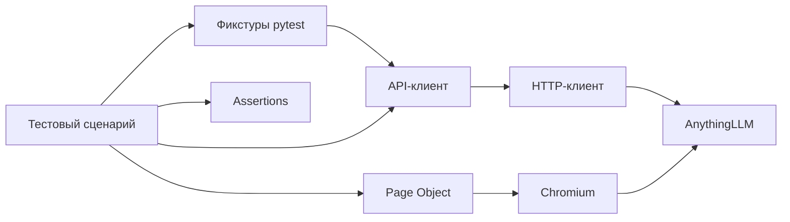

# Знакомство с тестовым фреймворком за один час

[English version](framework-onboarding.md)

Это руководство для инженера, который знает основы Python, но впервые видит этот
фреймворк. После чтения и знакомства с кодом вы сможете выбрать уровень проверки,
объяснить смысл успешного результата, найти подготовку и очистку данных,
разобраться с падением и добавить небольшой сценарий.

Фреймворк проверяет локальное приложение AnythingLLM, подключённое к Ollama.
Также он проверяет собственные HTTP-клиенты, фикстуры, отчётность и работу с
браузером. Архитектура разделена на слои с конкретными обязанностями. Дорогие
вызовы моделей отделены от быстрых проверок самого фреймворка.

## План на первый час

Предполагается, что Python и нужные зависимости уже установлены. Загрузка
пакетов, браузера и моделей потребует дополнительного времени. Чтобы понять
устройство фреймворка, запускать приложение и модель необязательно.

| Минуты | Что сделать | Что станет понятно |
| --- | --- | --- |
| 0–10 | Прочитать словарь и таблицу уровней тестирования. | Как работает приложение и на какие вопросы отвечают разные проверки. |
| 10–20 | Прочитать раздел об архитектуре и открыть файлы по ссылкам. | Где находятся запросы, действия в UI, подготовка данных и проверки. |
| 20–35 | Разобрать тест отпускной политики вместе с кодом. | Как pytest собирает зависимости и как сценарий взаимодействует с приложением. |
| 35–45 | Запустить офлайн unit-тесты и прочитать раздел об отчётах и падениях. | Как получить полезный результат без генерации ответа моделью. |
| 45–55 | Прочитать разделы о RAG и добавлении сценариев. | Чем отличаются проверка фактов, источников, контекста и оценка модели-судьи. |
| 55–60 | Ответить на вопросы для самопроверки. | Готовы ли вы самостоятельно ориентироваться в проекте и расширять его. |

Начните с этого документа, а [automation/README.md](../automation/README.md)
используйте как справочник команд. Файлы `step-*.md` описывают отдельные этапы
развития проекта. Они полезны для подробного изучения, но читать их все для
начала работы не требуется.

## 1. Сначала понять приложение

Пользователь загружает документ с правилами компании, задаёт вопрос и получает
ответ с источниками. Тестовый документ содержит вымышленные правила: например,
23 рабочих дня ежегодного отпуска и подачу заявки за 12 календарных дней до
его начала. В документе явно указано, что информация о компенсации спортзала
отсутствует.

| Термин | Что он означает в этом проекте |
| --- | --- |
| LLM | Языковая модель, которая генерирует ответ. |
| Ollama | Локальный сервис для моделей генерации и эмбеддингов. Тесты отправляют ему запросы; сама модель не выполняется внутри pytest. |
| AnythingLLM | Приложение, которое управляет документами, поиском, рабочими пространствами и чатом. |
| Workspace | Изолированная область приложения со своими настройками, индексированными документами и историей общения. Это не директория проекта в IDE. |
| Slug | Идентификатор workspace в URL, например `automation-<unique-id>`. |
| Embedding, эмбеддинг | Числовое представление смысла текста для поиска похожих фрагментов. Модель эмбеддингов помогает находить материал; итоговый ответ пишет модель генерации. |
| Индексация | Подготовка фрагментов документа и их эмбеддингов для поиска. Успешная загрузка файла ещё не доказывает, что workspace сможет найти его содержимое. |
| RAG | Retrieval-augmented generation: приложение находит подходящий контекст в документах и передаёт его в запросе модели. |
| Citation/source, источник | Ссылка на документ рядом с ответом. Это полезное свидетельство, но не обязательно весь контекст, переданный модели. |
| Fixture, фикстура | Зависимость, которой управляет pytest: она подготавливает данные или ресурсы и может регистрировать очистку. Тест запрашивает фикстуру через имя параметра. |
| Assertion, проверка | Условие, которое должно выполняться для успешного результата. |
| Judge, модель-судья | Модель, которой поручают оценить ответ. Она тоже может ошибаться, поэтому её работу нужно проверять. |

Модель генерации по умолчанию — `qwen3.5:4b`. Обычные RAG-тесты также используют
`qwen2.5:7b`, если модель не выбрана явно через параметр запуска. Вторая модель
нужна для сравнения результатов; это не утверждение о превосходстве одной из
моделей. Для эмбеддингов используется BGE-M3. Настройки можно посмотреть в
[шаблоне workspace](../config/workspace.json) и
[описании окружения](../README.md#components).

## 2. Выбирать самый простой уровень, который отвечает на вопрос

Успешный HTTP-ответ, видимое сообщение в чате и ответ, подтверждённый документом,
— разные результаты. Поэтому проверки разделены по уровням.

| Уровень | На какой вопрос отвечает | Что требуется извне | Где находится |
| --- | --- | --- | --- |
| Unit | Правильно ли фреймворк обрабатывает корректные, некорректные и ошибочные ситуации? | HTTP заменён моками. Для проверки перехвата запросов нужен Node.js; для части тестов адаптера судьи — библиотеки оценки. | `tests/unit/` |
| Офлайн браузер | Правильно ли Page Object выбирает элементы и ожидает состояние в настоящем браузере? | Chromium и предсказуемый локальный HTML; приложение и модели не нужны. | `tests/browser/` |
| Smoke/API | Доступно ли приложение, работает ли авторизация, можно ли управлять workspace и документами и выполнять поиск? | AnythingLLM и, где требуется, developer API key. Для индексации нужен сервис эмбеддингов. | `tests/test_health.py`, `test_authentication.py`, `test_workspace.py`, `test_documents.py` |
| RAG-интеграция | Содержит ли реальный ответ необходимые факты и источники либо признаёт отсутствие информации? | Приложение, API key, эмбеддинги и модель генерации. | `tests/test_rag.py` |
| UI приложения | Может ли пользователь отправить вопрос, увидеть ответ и источник, восстановить историю после перезагрузки? | RAG-окружение и Chromium. | `tests/ui/` |
| Качество по сохранённым данным | Относятся ли обычные проверки и сохранённая оценка судьи к одному и тому же ответу? | Сохранённые файлы и зависимости отчётности; новых вызовов модели нет. | `tests/test_quality.py` |
| Качество на живом окружении | Можно ли сгенерировать ответ, сохранить запрос, оценить его и построить отчёт с проверенной очисткой? | Дополнительная конфигурация перехвата, приложение и модели, зависимости оценки и отчётности. | `tests/test_live_quality.py` |

Такое разделение помогает искать причину падения и контролировать время запуска.
Ошибка кодирования URL воспроизводится через мок HTTP-сессии. Ошибка выбора
старого ответа в UI — через локальный HTML. Для этого не нужны вызовы модели.
Браузерный тест полезен, когда проверяемое поведение зависит от отображения или
действий пользователя. Когда важно только состояние приложения, API-тест проще.

В GitHub Actions выполняются быстрые проверки: Ruff и офлайн unit-тесты в одной
задаче, офлайн проверки Page Object в Chromium — в другой. API, RAG и UI-тесты
настоящего приложения запускаются локально. CI не запускает AnythingLLM и не
скачивает языковые модели. Настройки находятся в
[workflow](../.github/workflows/framework-checks.yml).

## 3. Понять обязанности каждого слоя

Пакет находится в `automation/src/llm_testkit`. Тесты используют его компоненты,
а подготовка ресурсов и отправка HTTP-запросов вынесены в соответствующие слои.



Схема показывает основные обязанности, а не каждый вызов функции. Отчётность
записывает отдельные операции этих слоёв. Критерии правильности ответа задаются
проверками.

| Файл или модуль | За что отвечает | Почему выделен отдельно |
| --- | --- | --- |
| [config.py](../automation/src/llm_testkit/config.py) | Неизменяемые настройки, переменные окружения, проверка URL и таймаутов. | Ошибку конфигурации проще обнаружить до того, как она превратится в непонятную сетевую ошибку. |
| [core/http_client.py](../automation/src/llm_testkit/core/http_client.py) | Сессия Requests, базовый URL, таймаут, ответ и закрытие сессии. | У клиентов единая транспортная политика. Автоматических повторов нет; редиректы по умолчанию отключены, чтобы их можно было проверить явно. |
| [clients/anythingllm_client.py](../automation/src/llm_testkit/clients/anythingllm_client.py) | Пути endpoint, кодирование URL, тела запросов и загрузка файлов. | Тест вызывает операцию вроде `create_workspace`, а не собирает запрос заново. Клиент возвращает исходный ответ и не задаёт критерии успеха теста. |
| [pages/workspace_page.py](../automation/src/llm_testkit/pages/workspace_page.py) | Локаторы, навигация, отправка вопроса и открытие источников. | Изменение интерфейса приложения можно исправить в одном месте. |
| [assertions/](../automation/src/llm_testkit/assertions/) | Повторно используемые проверки полей, API, ответов, качества и UI, по модулю на область. | API- и UI-сценарии используют общие правила и понятные сообщения об ошибках. |
| [test_support/fixtures/environment.py](../automation/src/test_support/fixtures/environment.py) | Пути, настройки, API-клиенты и общие профили сценариев. | Тестам не нужно самостоятельно искать ключи и дублировать чтение файлов. |
| [test_support/fixtures/resources.py](../automation/src/test_support/fixtures/resources.py) | Создание workspace и папок, загрузка документов, индексация и очистка. | Очистка должна работать и при падении теста, и при ошибке подготовки. |
| [test_support/fixtures/rag.py](../automation/src/test_support/fixtures/rag.py) | Выбор модели, метаданные, генерация и необязательный перехват запроса. | Для сравнения ответов нужно знать, какая модель и конфигурация их произвели. |
| [pytest_support/options.py](../automation/src/llm_testkit/pytest_support/options.py) | Параметры запуска, набор моделей и повторений, проверка явно включаемых режимов. | Правила выбора тестов находятся в одном месте и применяются после фильтрации через `-k` и `-m`. |
| `evaluation/` | Адаптер RAGAS, оценка подтверждённости утверждений и контрольные примеры для судьи. | Механизм оценки можно исследовать отдельно от сценариев приложения. |
| `reporting/` | Allure, объединённые результаты качества и сводки стабильности. | Отчёт должен показывать результаты, сохраняя исходный смысл проверок. |
| [tests/conftest.py](../automation/tests/conftest.py) | Регистрация плагинов и assertion rewriting. | Входная точка остаётся небольшой, а настройка распределена по тематическим модулям. |

Интеграционные тесты используют `Assertions` для проверки поведения приложения.
Unit-тесты используют обычные `assert` и `pytest.raises(..., match=...)` pytest,
независимые от Assertions приложения: сломанная функция проверки не должна проверять
собственный результат. Каждый тест отказа называет нарушенное правило и имеет парный
тест на допустимые данные. Общие тестовые данные берутся из публичных билдеров
`test_support/builders`, а данные одного модуля определяются в нём самом. Правила и
результаты мутационного тестирования описаны в [шаге 39](step-39-test-architecture.md).
В unit-тестах блокируются случайные вызовы Requests. Используются моки,
локальные подмены и, для проверки фикстур и выбора тестов, дочерние запуски pytest.

Это решения конкретного проекта. Выносить каждый `assert` в любом Python-проекте
или строить такое количество слоёв для любого приложения не требуется.

## 4. Разобрать один тест отпускной политики

Откройте [UI-тесты](../automation/tests/ui/test_workspace_chat.py). Первый
сценарий выполняет следующие действия:

```python
workspace_page.send_question(paid_leave_profile["question"])
assertions.assert_ui_question_visible(workspace_page, paid_leave_profile["question"])
assertions.assert_ui_policy_answer(
    workspace_page, fact_patterns=paid_leave_profile["fact_patterns"]
)
workspace_page.open_sources()
assertions.assert_ui_document_source(
    workspace_page, title=uploaded_policy_document["title"]
)
```

Тело теста содержит действия и проверки. Подготовка HTTP-данных, очистка,
ожидания и шаги Allure находятся в других слоях. Декоратор `@title` задаёт
понятное название в Allure. Полный сценарий начинается с его фикстур.

### До тела теста: зависимости фикстур

`workspace_page` зависит от `rag_environment`, браузерной фикстуры `page`,
настроек и `indexed_workspace`. Pytest подготавливает зависимости до входа
в тест. Основная цепочка ресурсов:

```text
settings + workspace configuration
  -> temporary_workspace
  -> document_folder
  -> uploaded_policy_document
  -> indexed_workspace
  -> rag_environment
  -> workspace_page
  -> test body
```

Это упрощённая схема: дополнительно pytest подготавливает каталог моделей,
метаданные и браузерный контекст. Фикстура, запрошенная по двум путям, повторно
используется внутри одного теста. Поэтому параметр `uploaded_policy_document`
в самом тесте не приводит ко второй загрузке документа.

1. Фикстуры окружения читают шаблон workspace, документ и профиль сценария.
   Ключ авторизации берётся из окружения или локального файла.
2. Фикстуры ресурсов создают workspace и папку с уникальным именем
   `automation-...`, загружают документ и добавляют его в индекс workspace.
3. RAG-фикстуры проверяют установленную модель и настройки workspace, записывают
   digest модели, хеш документа, конфигурацию и сведения о повторении.
4. UI-фикстура создаёт Page Object и открывает временный workspace. Фикстура
   `page` предоставляется pytest-playwright с изолированным контекстом браузера.

Даже для UI-теста данные подготавливаются через API: этот сценарий проверяет
чат, поэтому подготовка документов не требует ручных действий в браузере.
Отдельный тест загрузки документа через UI выполнял бы именно загрузку в UI.

### Во время теста: действия и критерии успеха

`send_question` перед отправкой считает уже существующие ответы ассистента.
Затем Page Object выбирает ответ по этому индексу. Так проверка ожидает ответ
на новый вопрос и не принимает предыдущий ответ во время генерации.

`assert_ui_completed_answer` ожидает контейнер итогового ответа, видимую кнопку
Send и непустой итоговый текст. При пустом поле ввода Send может быть отключена:
это допустимо после завершения генерации. Панель Thoughts отделена от итогового
ответа. Источники проверяются отдельно: ответ может завершиться без ссылки.

Проверка отпускной политики ищет оба обязательных факта из общего профиля.
Проверка источника ищет название загруженного документа. Другие UI-сценарии
открывают подтверждающие фрагменты, проверяют отсутствие информации и точное
сохранение истории после перезагрузки. Отдельные проверки прикладывают текст
ответа и скриншоты.

### После теста: очистка через finalizer

Фикстура регистрирует очистку сразу после получения пригодного идентификатора
созданного ресурса, до последующих проверок его структуры. Поэтому созданный
ресурс можно удалить даже при ошибке загрузки, индексации или самого теста.

Зависимые ресурсы удаляются раньше родительских: сначала папка документов
с проверкой её отсутствия, затем workspace с проверкой его отсутствия.
Если одна очистка падает, pytest выполняет остальные finalizer. Успешное тело
теста при ошибке очистки не означает полностью успешный запуск: смотрите teardown.

Если создание завершилось таймаутом или не вернуло пригодный идентификатор,
надёжно установить принадлежность ресурса нельзя. В такой ситуации фреймворк
не гарантирует очистку и не пытается угадывать её через удаление чужих workspace.

## 5. Понять, что доказывают проверки LLM

### Проверять факты с учётом вариативности формулировок

Модель может выразить одно правило разными словами. Сравнение полного ответа
с единственной строкой отклоняло бы допустимые перефразирования. Поэтому общий
[профиль отпускной политики](../automation/test_data/quality-paid-leave.json)
содержит вопрос, эталон, шаблоны обязательных фактов и фрагменты источников.
Его используют API- и UI-сценарии.

Эталон описывает ожидаемый ответ и сохраняется в записанных примерах. Обычные
RAG-проверки не сравнивают с ним весь текст. Текущая метрика faithfulness
оценивает утверждения ответа по перехваченному контексту. Наличие эталона в файле
само по себе не добавляет отдельную метрику правильности ответа.

Regex-проверки — небольшие smoke-проверки. Они могут пропустить отрицание или
противоречие, если ожидаемые слова и числа всё равно присутствуют. Успех означает
совпадение с шаблонами, а не семантическую правильность каждого предложения.
Для более строгих проверок нужны дополнительные размеченные примеры или методы
оценки.

[Профиль отсутствующей политики](../automation/test_data/missing-policy.json)
задаёт вопрос о компенсации спортзала. Проверка требует явного указания на
отсутствие информации, правильной темы и отсутствия придуманной суммы выплаты.
Она обнаруживает простой вид галлюцинации, который не покрывает позитивный
сценарий про отпуск. Сейчас эта функция специфична для спортзала; она не является
универсальной проверкой любого вопроса без ответа.

### Поиск, ссылки и подтверждённость утверждений

Проверки векторного поиска показывают, что загруженный документ находится
с ожидаемыми фрагментами. Проверки источников ответа проверяют документ и цитаты.
Они не устанавливают весь контекст, реально переданный генератору.

Необязательный перехват на границе SDK сохраняет настоящий запрос модели
для API-сценария без потоковой передачи. При построении примера извлекаются
документные контексты и проверяются маркер перехвата, модель и вопрос.
Потоковый UI-сценарий этим механизмом не покрывается.

RAGAS faithfulness разбивает ответ на утверждения и спрашивает локальную
модель-судью, подтверждается ли каждое из них контекстом. Текущий адаптер допускает
не более двух вызовов судьи, использует структурированный JSON и отклоняет
обрезанные или некорректные результаты без повторов. Температура равна нулю,
thinking отключён, задан seed. Это уменьшает вариативность, но не гарантирует
безошибочную оценку.

Для судьи есть вручную размеченные контрольные примеры: подтверждённые,
противоречащие документу и выдуманные утверждения, включая перефразирования
и подмену рабочих дней календарными. Они проверяют совпадение с известными
оценками, а не только способность вернуть правдоподобное число.

Общий отчёт разделяет обязательные факты, источники и faithfulness. Данные судьи
связаны с записанным примером через SHA256. Проверяются покрытие утверждений,
бинарные вердикты и согласованность итоговой оценки. Хеш обнаруживает несовпадение
файлов; он не доказывает правоту судьи и не защищает от изменения одновременно
данных и их хеша.

Откалиброванного порога faithfulness сейчас нет. Любая корректная завершённая
оценка в допустимом диапазоне может получить статус `measured`. Идеальный score
не скрывает отсутствие обязательного факта; низкий корректный score тоже не
означает автоматического падения по порогу. Ошибки судьи остаются ошибками.
Перед выводом о качестве модели читайте статусы отдельных измерений и приложенные
данные.

### Почему вызовы моделей ограничены и нет автоматических повторов

Генерация может различаться между запусками, нагружает локальное оборудование
и выполняется намного дольше моков. Живая оценка качества включается явно
и ограничена одним выбранным сценарием, моделью и запуском: один ответ и не более
двух вызовов судьи. Браузерные проверки тоже нужно включать явно. Обычные
API/RAG-тесты входят в набор по умолчанию, поэтому команда `python -m pytest`
без выбора тестов не является офлайн-запуском.

Две модели и параметр `--rag-repeat` позволяют провести небольшое сравнение
или исследование стабильности. Каждое повторение получает новые ресурсы.
Повторение для измерения вариативности отличается от повторного запуска
неудачного ответа до первого успеха. Последнее фреймворк автоматически не делает.
Повторяющиеся ожидания Playwright проверяют состояние той же страницы и не
отправляют модели новый вопрос.

Прежде чем называть падение flaky, сравните digest модели, хеш документа,
конфигурацию workspace, сведения о повторении и саму ошибку. Смена модели,
изменение документа, ошибка подготовки, устаревший локатор и вариативный ответ
требуют разных расследований. Большие выборки и параллельные вызовы моделей
выходят за пределы проверенного режима этой небольшой системы.

## 6. Запускать проверки в понятном порядке

Из корня репозитория начните с окружения для офлайн-проверок:

```bash
cd automation
python3.12 -m venv .venv
source .venv/bin/activate
python -m pip install -r requirements.lock -r requirements-dev.lock
python -m pip install --no-deps -e .
python -m pytest tests/unit -q
python -m ruff check src tests
python -m isort --check-only --diff src tests
python -m yapf --diff --recursive src tests
```

Если `.venv` уже настроено, используйте его. Без библиотек оценки часть
unit-тестов адаптера RAGAS может пропускаться. Установите зависимости из
`requirements-evaluation.lock`, чтобы запускать и их: для ответов-моков
работающая модель не нужна. Для unit-проверки перехвата нужен Node.js.
Структура `src` и установка в editable-режиме явно определяют импортируемый
пакет и уменьшают зависимость от рабочей директории IDE.

Для предсказуемых проверок Page Object установите UI-зависимости и Chromium:

```bash
python -m pip install -r requirements-ui.lock
python -m playwright install chromium
python -m pytest tests/browser --run-ui
```

Перед интеграционными проверками выполните
[настройку приложения](../README.md#start-and-stop). Задайте developer API key
через `ANYTHINGLLM_API_KEY_FILE` или `ANYTHINGLLM_API_KEY`. По умолчанию ключ
ищется в `.runtime/anythingllm-api-key` в корне репозитория. Настоящие ключи
и данные работающего окружения не должны попадать в отслеживаемые файлы.
Настройки скрывают ключ в своём `repr`.

Запускайте уровни отдельно из директории `automation`:

```bash
python -m pytest tests -m 'smoke or api'
python -m pytest tests/test_rag.py --rag-model qwen3.5:4b
python -m pytest tests/ui --run-ui -k source_details
```

RAG-команда запускает два сценария на одной модели; UI-команда — один сценарий.
Без `--rag-model` обычные RAG-тесты используют обе модели. UI использует модель
из шаблона workspace и не расширяется в набор моделей этого CLI-параметра.
Индексация документов всё равно вызывает сервис эмбеддингов.

Зависимости разделены на профили с зафиксированными версиями: базовые,
разработка, UI, отчётность и оценка. Для работы с HTTP-клиентом не обязательно
устанавливать браузер и библиотеки судьи. Фиксация версий делает окружение
воспроизводимее, но обновления всё равно требуют проверки совместимости.

Для живого перехвата нужны дополнительная Compose-конфигурация и параметры
запуска. Используйте [отдельную инструкцию](step-15-live-quality.md);
при первом знакомстве включать этот режим не требуется.

## 7. Читать отчёты и искать причину падения

Pytest выполняет тесты и определяет результаты setup, call и teardown.
Allure показывает шаги и вложения. RAGAS рассчитывает метрику оценки.
Прикреплённый score сам по себе не задаёт порог качества.

Необязательный слой отчётности передаёт `@title` в Allure и записывает выбранные
операции через статические названия `@step`. Ключи, заголовки и аргументы функций
автоматически к этим шагам не прикладываются. Текст ответа, скриншоты,
перехваченные примеры и результаты судьи добавляются явно, где это полезно.
Allure необязателен для обычных API-, UI- и unit-тестов. Сценарии общего отчёта
качества по сохранённым и живым данным требуют зависимостей отчётности.

Из `automation`, после установки зависимостей отчётности и UI, можно получить
диагностические данные одного UI-сценария:

```bash
python -m pytest tests/ui --run-ui -k source_details \
  --tracing retain-on-failure --screenshot only-on-failure \
  --output reports/onboarding/browser \
  --alluredir reports/onboarding/allure-results
npm --prefix tools/allure ci
npm --prefix tools/allure exec -- allure generate reports/onboarding/allure-results \
  --output reports/onboarding/allure-report
```

Для каждого запуска используйте новую директорию. Локальный Allure CLI
устанавливается через `tools/allure`. Пакет `allure-pytest` записывает результаты,
а генерация отчёта выполняется отдельным CLI. Сохранённые скриншоты и трассировки
падения прикладывает UI-хук teardown. Отчёты могут содержать данные приложения
и исключены из Git. GitHub Actions сохраняет артефакты unit- и браузерных
проверок отдельно.

| Симптом | Что проверить сначала | Какой вывод преждевременен |
| --- | --- | --- |
| Ошибка импорта или неизвестный параметр CLI | Editable-установку, выбранные тесты, плагины pytest и дополнительные зависимости. | Что сломано приложение или модель. |
| Connection refused или таймаут | Настройки, запущенный сервис, порт и конкретный таймаут. | Что увеличение всех таймаутов решит проблему. |
| Отказ авторизации | Конфигурацию developer key и смысл позитивного или негативного сценария. | Что любой 401 — регрессия. |
| Загрузка прошла, но поиск ничего не находит | Индексацию workspace, эмбеддинги и идентификатор документа в ответе. | Что успешная загрузка уже доказывает готовность поиска. |
| UI ждёт отсутствующий или неправильный ответ | Индекс ответа, DOM приложения, контейнер итогового текста и офлайн браузерный тест. | Что обязательно сломалась генерация. |
| Не прошла проверка фактов или отсутствия информации | Итоговый текст, профиль, источники и метаданные модели и конфигурации. | Что ссылка или высокий score судьи доказывают правильность. |
| Не прошла валидация результатов судьи | Хеш примера, покрытие утверждений, статус завершения и структурированный ответ. | Что ответ не прошёл откалиброванный порог качества. |
| Ошибка teardown | Finalizer и идентификаторы принадлежащих тесту workspace и папки. | Что успешное тело теста гарантирует удаление всех ресурсов. |

Сначала изучите исходную ошибку setup или call. Ошибки очистки рассматривайте
отдельно. Дефекты фреймворка и локаторов полезно воспроизводить офлайн, прежде
чем снова тратить вызовы моделей.

## 8. Добавить небольшой сценарий в существующие слои

В тестовой политике также описаны командировочные выплаты и лимиты гостиницы.
Новый API RAG-сценарий может использовать существующий документ и фикстуры
ресурсов. Новый HTTP-клиент или базовый класс тестов для этого не нужен.

1. Создайте английский профиль в `test_data/`: вопрос, эталон, обязательные факты
   и фрагменты источников. Ожидания берите из документа, а не из ответа модели.
2. При необходимости добавьте фикстуру чтения профиля в
   `test_support/fixtures/environment.py`. Общие данные не дублируйте в телах тестов.
3. Добавьте тест рядом с `tests/test_rag.py`, используя `rag_chat`, загруженный
   документ и профиль. Задайте понятный `@title` и соответствующий маркер.
4. Используйте `assert_rag_answer` для позитивной проверки фактов и источников.
   Для нового правила добавьте отдельную проверку и unit-примеры допустимого
   и недопустимого поведения. Не расширяйте regex только ради последнего ответа
   модели.
5. Запустите офлайн-проверки, затем один новый сценарий на одной модели.
   Изучите результаты и очистку. Добавляйте вторую модель и повторения, когда
   это отвечает на конкретный вопрос.

Для изменения только UI помещайте локаторы и действия в Page Object.
Офлайн браузерный тест полезен для защиты от реальной ошибки выбора элемента
или ожидания. Критерии успеха размещайте в Assertions. Тест описывает сценарий;
шаги Allure, скриншоты и сборка endpoint остаются в соответствующих слоях.

Изменяемые ресурсы имеют область `function`: каждый тест получает своё состояние.
Повторно используйте код фикстуры, сохраняя независимость workspace.
Автоматические повторы, параллельные вызовы моделей и новые пороги оценки —
отдельные решения, требующие обоснования и проверки их влияния на смысл тестов.

## Расширение: golden dataset

[Описание датасета](step-22-golden-dataset.md) добавляет 16 версионированных
сценариев с эталонами, обязательными и запрещёнными шаблонами и фрагментами
источников. Набор включается через `--run-golden`; начинайте с одного вопроса
на одной модели. Проверки структуры и эталонов выполняются офлайн. Датасет не задаёт пороги AI-качества. Следующий этап —
[оценка correctness](step-23-factual-correctness.md): необязательная метрика
RAGAS factual F1 относительно эталона, максимум четыре вызова судьи и четвёртое
измерение сохранённого отчёта. Откалиброванного порога для неё пока нет.

## 9. Проверить понимание

Перед первым новым сценарием попробуйте ответить своими словами:

- Какая команда запускает офлайн unit-тесты и чем отличается `python -m pytest` без выбора тестов?
- Где создаётся временный workspace и когда регистрируется его очистка?
- Почему документы для UI-тестов чата подготавливаются через API?
- Как Page Object избегает проверки старого ответа вместо нового?
- Почему факты, ссылки и перехваченный контекст проверяются отдельно?
- Что доказывает записанный faithfulness-score и какие вопросы оставляет открытыми?
- Почему общий слой unit-проверок независим от Assertions приложения?
- Где менять endpoint, локатор, фикстуру, сценарий или отчёт?

Если вы можете проследить тест отпускной политики через фикстуры, клиент или
Page Object, проверки и очистку, у вас уже есть основа для работы с фреймворком.
Актуальные команды находятся в [automation/README.md](../automation/README.md),
причины последних структурных изменений — в
[описании рефакторинга](step-21-framework-refactoring.md).

## Новые проверки качества

После базового сценария отпуска можно изучить четыре дополнения:

- [Context precision/recall](step-24-context-relevance.md): полезность найденного контекста и покрытие фактов эталона оцениваются отдельно от правильности ответа.
- [Prompt regression](step-25-prompt-regression.md): сравнение версий промпта при одинаковых golden-ожиданиях и остальных настройках.
- [Adversarial inputs](step-26-adversarial-inputs.md): попытки подменить инструкции и факты; для атаки через документ обязательно доказать попадание текста в контекст модели.
- [Quality gates](step-27-quality-gates.md): явные экспериментальные пороги для проверенных evidence и минимальное покрытие кода фреймворка в CI.

Полные матрицы запускаются явно. Порог качества здесь учебный и не откалиброван для клинической системы; успех одного сохранённого ответа не означает успех всего датасета.

## Мониторинг и квалификационные протоколы

- [История метрик](step-28-metric-history.md): сохраняет результаты с версиями модели, данных и оценщика; сравнивает новые наблюдения с выбранной базовой линией.
- [Производительность](step-29-performance.md): ограниченные HTTP/RAG-нагрузки, длительность каждой попытки и явно заданные пороги ошибок и задержки.
- [Парные bias-проверки](step-30-bias.md): меняют описание сотрудника при одинаковых критериях ответа по политике.
- [Test plan](test-plan.md) и [учебные IQ/OQ/PQ-протоколы](step-31-qualification-evidence.md): связывают требования с матрицей тестов, сохраняют отклонения и собирают пакет evidence для выбранных фаз.

Один успешный сценарий не закрывает всю матрицу. Полные прогоны включаются явно. Успешное выполнение учебного протокола не означает статистическую валидацию или GxP-одобрение; статус проверки человеком остаётся pending.
